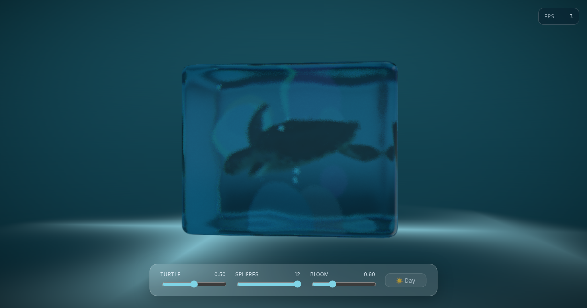

# Aquarium

**Live demo → [marvinbaudach.github.io/aquarium](https://marvinbaudach.github.io/aquarium/)**



An interactive 3D aquarium built with React Three Fiber. A rigged Kemp's Ridley sea
turtle swims inside a transmissive glass cube, surrounded by floating colored spheres.
It started as a port of the [pmndrs aquarium demo](https://pmndrs.github.io/examples/demos/aquarium)
and grew into a small production-grade showcase: tune the scene live, share your
configuration by URL, and watch the renderer adapt its resolution to your GPU in real time.

## Interaction

| Input | Effect |
|---|---|
| Drag | Orbit around the aquarium |
| Control dock | Live-tune turtle speed, sphere count, bloom, day/night |
| FPS pill (top-right) | Expand for live FPS, DPR, triangle and draw-call counts |
| URL | Every control is serialized to the query string — copy the link to share a configuration |
| Auto | Cinematic camera fly-in on load; turtle swims its `Swim Cycle`; spheres drift via `Float` |

## Features

### Scene
- **Glass cube aquarium** — a single mesh rendered with `MeshTransmissionMaterial`: transmission, chromatic aberration, anisotropy, distortion and iridescence, with the `backside` pass so the turtle reads through both panes
- **Stencil-masked contents** — everything inside the cube (`useMask`) is clipped to the glass volume so spheres and turtle stay within the tank
- **Animated sea turtle** — a rigged Kemp's Ridley GLB (SkinnedMesh) playing its `Swim Cycle`, with a gentle sinusoidal roll on `rotation.z`
- **Floating spheres** — instanced colored spheres (`Instances`/`Instance`) each wrapped in `Float` with per-sphere speed, scale and color
- **Soft shadows** — `AccumulativeShadows` with a `RandomizedLight` for a noise-free shadow under the tank
- **Custom environment** — a hand-built `Environment` of `Lightformer` strips and circles baked into a 1024px cubemap for glass reflections
- **Cinematic entrance** — `CameraControls` eases from a wide vantage into the resting framing on load (skipped under reduced-motion)
- **Deep-sea backdrop** — a vertical gradient sphere (lit surface → dark depth) replaces the flat background, with day/night palettes
- **Seabed caustics** — animated water-light patterns projected onto the floor via a single additive shader plane (no render targets — far cheaper than ray-traced caustics)
- **Living water** — a continuous bubble stream plus ~90 drifting suspended particles ("marine snow"), all stencil-clipped to the tank

### Engineering
- **Suspense loading screen** — a progress overlay driven by drei's `useProgress` while the ~2 MB turtle GLB streams in; assets are preloaded via `useGLTF.preload`
- **WebGL error boundary** — graceful fallback for missing WebGL2 or a lost context instead of a blank canvas
- **Adaptive quality** — `PerformanceMonitor` trims DPR live against the frame budget; low-power devices are detected by pointer capabilities, not window size
- **Reduced-motion aware** — respects `prefers-reduced-motion` by disabling `Float`, the swim animation and the intro flight
- **Shareable state** — controls persist to `localStorage` and the URL, validated and clamped on read
- **Live stats overlay** — FPS / DPR / triangle / draw-call counters fed by a shared ref so reporting costs zero scene re-renders
- **Accessible UI** — labelled controls, `aria-valuetext`, `aria-pressed`, a described canvas, visible focus rings and a `<noscript>` fallback

## Engineering Decisions

A few choices worth calling out, since this is as much an engineering sample as a visual one:

- **Stencil masking over clipping planes.** Contents are confined to the tank with a stencil buffer (`useMask`) rather than six clipping planes. It's a single shared mask, plays nicely with the transmission material's `backside` pass, and avoids per-material plane bookkeeping.
- **DPR trimming instead of fixed LOD.** Rather than guessing a quality tier up front, the scene renders at a target DPR and lets `PerformanceMonitor` walk it up or down against the real frame budget. A wrong initial guess self-corrects within a second or two.
- **Stats via a ref, not state.** The in-canvas `StatsBridge` writes renderer info into a shared ref every frame; the DOM overlay polls that ref on its own 500 ms clock. Per-frame React state would re-render the whole scene tree — this keeps the cost off the hot path.
- **State in the URL.** The control state is the single source of truth and is serialized to query params, so a configuration is a shareable link with no backend.

## Tech

| | |
|---|---|
| Renderer | React Three Fiber 9 + Three.js 0.184 |
| Helpers | @react-three/drei 10 (MeshTransmissionMaterial, useMask, Float, Instances, AccumulativeShadows, Environment, Lightformer, CameraControls, PerformanceMonitor, useProgress, useGLTF, useAnimations) |
| Framework | Vite 8 + React 19 |
| Language | TypeScript 6 (strict, type-checked ESLint) |
| Testing | Vitest + Testing Library (jsdom) |
| Hosting | GitHub Pages via GitHub Actions |

## Local Development

```bash
npm install
npm run dev
```

Open [localhost:5173](http://localhost:5173).

## Scripts

```bash
npm run dev          # Vite dev server
npm run build        # type-checked production build (tsc --noEmit && vite build)
npm run preview      # serve the production build locally
npm test             # run the Vitest suite once
npm run test:watch   # watch mode
npm run lint         # ESLint (strict, type-aware) + tsc --noEmit
```

A Husky pre-commit hook runs `eslint --fix` on staged `src` files.

## Project Structure

```
src/
├── index.tsx               # mount + sphere data injection
├── App.tsx                 # Canvas, Suspense/ErrorBoundary, scene composition, intro flight
├── types.ts                # shared prop types (SphereData, Aquarium/Turtle/Sphere props)
├── data/
│   └── spheres.ts          # named floating-sphere configuration
├── hooks/
│   ├── useAdaptiveQuality.ts   # low-power + reduced-motion detection, live DPR
│   └── useSceneControls.ts     # control state with URL + localStorage persistence
├── components/
│   ├── Aquarium.tsx        # glass cube (MeshTransmissionMaterial) + stencil-masked contents
│   ├── Turtle.tsx          # rigged turtle GLB, Swim Cycle animation + roll
│   ├── Sphere.tsx          # single instanced sphere wrapped in Float
│   ├── Spheres.tsx         # Instances container mapping the sphere data
│   ├── SoftShadows.tsx     # AccumulativeShadows + RandomizedLight
│   ├── AquariumEnvironment.tsx  # Lightformer-based Environment cubemap
│   ├── PostProcessing.tsx  # Bloom (EffectComposer)
│   ├── MouseParallax.tsx   # subtle pointer-driven scene parallax
│   ├── SeaBackground.tsx   # deep-sea vertical gradient backdrop
│   ├── Caustics.tsx        # animated seabed caustics (additive shader plane)
│   ├── Motes.tsx           # drifting suspended particles (marine snow)
│   ├── Bubbles.tsx         # ascending bubble stream
│   ├── ControlDock.tsx     # glassmorphism control panel (CSS Modules)
│   ├── SceneLoader.tsx     # Suspense progress overlay (useProgress)
│   ├── StatsOverlay.tsx    # in-canvas StatsBridge + DOM FPS/DPR/tris overlay
│   └── WebGLErrorBoundary.tsx   # WebGL2 detection + render-crash fallback
├── test/
│   └── setup.ts            # Testing Library + jest-dom + localStorage shim
└── assets/
    ├── shapes-transformed.glb  # glass-cube mesh
    └── model_52a_-_kemps_ridley_sea_turtle_no_id-transformed.glb  # rigged turtle
```

## Credits

Turtle model — **Model 52A - Kemps Ridley Sea Turtle (no ID)** by
[DigitalLife3D](https://sketchfab.com/DigitalLife3D), licensed under
[CC-BY-NC-4.0](http://creativecommons.org/licenses/by-nc/4.0/).
[Source on Sketchfab](https://sketchfab.com/3d-models/model-52a-kemps-ridley-sea-turtle-no-id-7aba937dfbce480fb3aca47be3a9740b).

Original demo by the [pmndrs](https://pmnd.rs/) collective
([source](https://github.com/pmndrs/examples/tree/main/demos/aquarium)).
